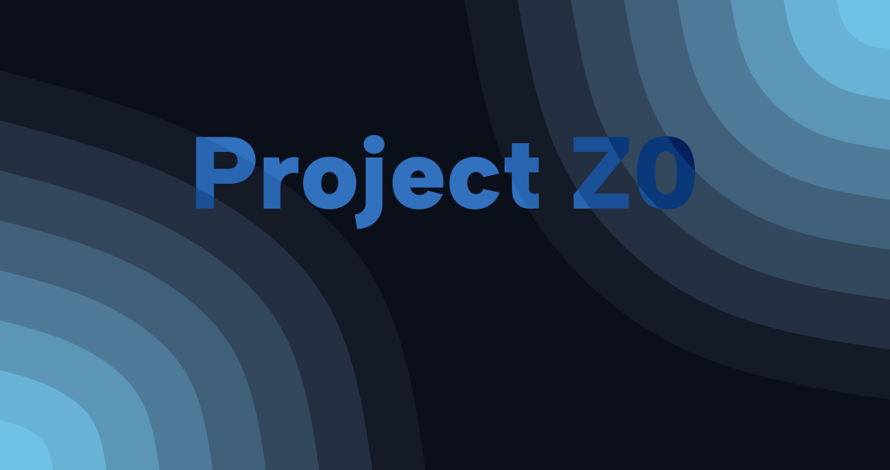

> 🌌 **Procedural Worlds** | 🔥 **Dynamic Events** | ⚔️ **Faction Warfare** | 📈 **Live Economy** | 📚 **Deep Lore**

---

> "Sometimes imagination is more powerful than sight."

**Project Z0** is a real-time, text-driven multiplayer game focused on exploration, strategy, and survival — without traditional graphics. Inspired by *Helldivers II*, *Pokémon GO*, and minimalist game design, it is currently mobile-only.

---

## 🌍 Features

- **Mobile Focused**: Built for mobile devices with future expansion planned.
- **Text-Driven Experience**: Gameplay driven by events, choices, and sector navigation.
- **Real-Time Multiplayer**: Robust session system for secure and fast gameplay interactions.
- **Customizable Loadouts**: Items, weapons, and abilities with rarity and dynamic attributes.
- **Dynamic Economy**: Item prices fluctuate based on supply and demand through player actions.
- **Event-Driven Gameplay**: Spontaneous events that change sectors, economies, and lore.
- **Deep Lore System**: Persistent universe with factions, history, and evolving narrative.
- **Secure and Scalable Server Backend**: Emphasis on authentication and session robustness.

---

## 📊 Tech Stack

| Technology    | Purpose                                      |
| ------------- | -------------------------------------------- |
| **Python**    | Backend server                               |
| **CouchDB**   | Accounts, items, sectors, shops, loadout, lore, events |
| **KCP/UDP**   | Real-time gameplay networking protocol       |
| **HTTP (basic)** | Login, registration, and session validation |

- No WebSocket dependency — uses **KCP** for efficient UDP packet delivery.
<!--- Simple Docker deployment with automated Git syncing and environment generation.-->

---

## 🚀 Architecture Overview

```plaintext
[Mobile Client]
    ├── HTTP (TCP) 
    │     ├─ Register
    │     ├─ Login
    │     ├─ Session Validation
    │     └─ Static Data Fetching (e.g., item lists, basic lore)
    │
    └── KCP (UDP)
          ├─ Real-Time Gameplay Communication
          ├─ Player Actions (movement, interaction, combat)
          └─ Sector Event Handling

[Server]
    ├── API Service (Python)
    │     ├─ Authentication
    │     ├─ Session Management
    │     └─ Request Routing
    │
    ├── Game Logic Service (Python)
    │     ├─ Sector State Management
    │     ├─ Event System (spontaneous and scheduled)
    │     ├─ Dynamic Economy Controller
    │     ├─ Procedural World Generator
    │     └─ Combat and Item Systems
    │
    ├── CouchDB
    │     ├─ Persistent Player Data
    │     ├─ Items, Loadout, Shops
    │     ├─ World and Sector States
    │     ├─ Event History
    │     └─ Lore Database
    │
    └── Redis
          ├─ Database Cache
          └─ Login Tokens
```

## 🧭 Roadmap/Feature List

- [x] KCP Real-Time Protocol Setup.
- [x] CouchDB Integration.
- [x] Redis Integration.
- [x] Core Frameworks for testing and development.
- [ ] Core Authentication and Session Framework.
- [ ] Implementing Easy Testing for each file.
- [ ] IP Banning and other Anticheat measures.
- [ ] Player Movement and Sector Interaction.
- [ ] Loadout, Abilities, and Item System.
- [ ] Lore and game story.
- [ ] Real-Time Event Generation.
- [ ] Dynamic Economy Implementation.
- [ ] Procedural Sector Generation.
- [ ] Achievements and Progression.
- [ ] Android Mobile Client Early Alpha.

## 🔄 Unplanned Features

- [ ] iOS Mobile Client.
- [ ] Browser Client.
- [ ] Modding and Plugin Support.
- [ ] Maybe a Server port to C# or Java?

---

## 🧳 Contributing

Currently not accepting external contributions.  
If you have suggestions, ideas, or bug reports, feel free to open an issue or discussion!

> Future plans include opening up contributions once core systems are stable and public testing servers are in place.

---

## 📃 License

Project Z0 is **PROPRIETARY** during its development phase.  
Potential future licensing will be evaluated once a playable alpha is released.

---

## 👥 Authors

- **Lead Developer:** 
- **Design Inspiration:** Helldivers II, Pokémon GO, Material 3 UX philosophy

---

## 🌟 Acknowledgements

- Thanks to the open-source community for protocol and database libraries.
- Inspired by minimalist and session-based multiplayer designs.

---

> "In the absence of sight, strategy becomes your vision."
> – Project Z0 Team