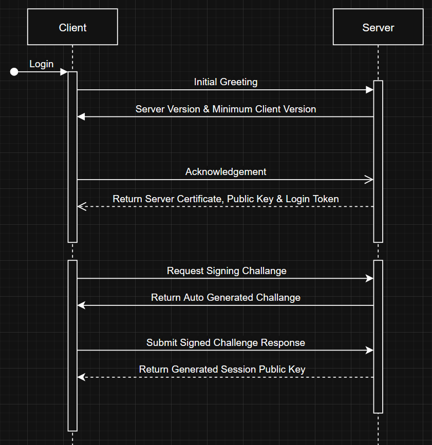

# Project Z0 Server Security Architecture

# Overview
This project implements a secure client-server authentication protocol, ensuring trust even over untrusted networks.  
The system is based on a combination of **public key cryptography**, **certificate signing**, **challenge-response authentication**, and **XOR-based encryption**.

It is designed for open-source projects where official and unofficial servers must be distinguishable by clients.

## Detailed Protocol Steps:
- Client connects and sends Initial Greeting.
    - Includes Client Version.
- Server responds with:
    - Server Version.
    - Minimum Client Version Required.
- Client acknowledges, saying "OK."
- Server sends:
    - Server Session Public Key.
    - Server Certificate (signed by Default Root Private Key).
    - Temporary Login Token (optional, could be a nonce).
- Client requests a signing challenge.
- Server returns:
    - Random Challenge (could be a 256-bit random string).
- Client signs the Challenge using the verified Server Public Key.
- Client submits the signed Challenge Response.
- Server verifies the signed Challenge.
- Server returns:
    - Confirmed Session Public Key (ready to start session).
- Both sides enable XOR encryption from now on.

## Authentication Flow
1. **Server Boot**:
    - If no server session key exists, generate a new ed25519 keypair.
    - Sign the server public key with the default private key to generate a certificate.

2. **Client Connection**:
    - Client connects to the server.
    - Server sends the session public key + the signed certificate.

3. **Certificate Verification**:
    - Client verifies the server certificate using the embedded root public key.
    - If verification fails, connection is terminated.

4. **Challenge-Response Authentication**:
    - Client sends a random challenge to server.
    - Server signs the challenge using its session private key.
    - Client verifies the signature using the verified session public key.

5. **XOR Encrypted Communication**:
    - After successful authentication, the client and server encrypt traffic using a symmetric XOR encryption key.
    - XOR key can either be negotiated per session or be predefined.

## Security Layers
- **Public Key Cryptography**: Ensures server authenticity.
- **Certificate Authority Logic**: Allows rotating server keys while maintaining trust.
- **Challenge-Response**: Prevents replay attacks.
- **XOR Encryption**: Obfuscates data over the network for an additional security layer.

## Threat Model
- **Man-In-The-Middle (MITM)**: Mitigated via certificate verification.
- **Replay Attack**: Mitigated with challenge-response mechanism.
- **Packet Sniffing**: Mitigated with XOR encryption.

## Future Improvements
- TODO: Implement systems to ensure data security while gathering system information.
- TODO: Implement session-specific XOR keys for enhanced secrecy.
- TODO: Add timestamps or nonces to certificates to reduce misuse risk.
- TODO: Add timestamps to every HTTP or UDP packet/message sent over the network.